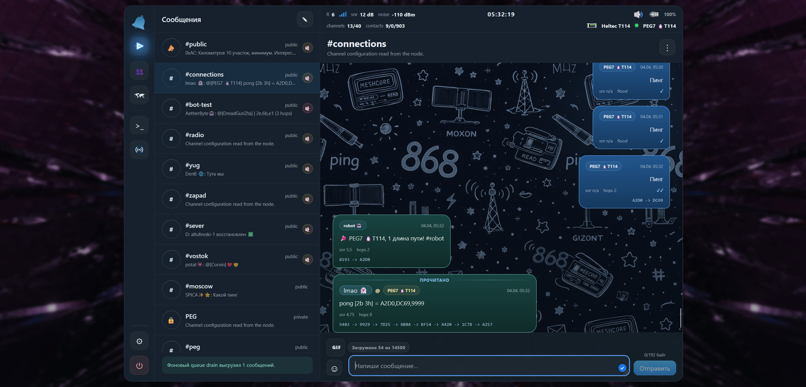

# MeshCorium

Basic project overview:

- Full Russian README: [README_RU.md](./README_RU.md)
- Full English README: [README_EN.md](./README_EN.md)
- Changelog: [CHANGELOG.md](./CHANGELOG.md)

MeshCorium is a self-hosted MeshCore client with a hybrid contact system and a local web interface for working with a MeshCore node through companion firmware.

`MeshCorium v0.6.1 -- Docker + USB + BLE` ships the Docker Compose packaging variant, permanent USB serial transport, BLE node connection through Linux / BlueZ, and browser-side unread notifications.

Current development workspace note:

- experimental Wi-Fi / TCP transport integration is in progress;
- the active dev code now includes a manual `host:port` Wi-Fi connect path and backend TCP transport plumbing;
- this work is not yet release-validated and is not part of the published `v0.6.1` release notes.

## Preview

## Release Status

The latest published release is `MeshCorium v0.6.1 -- Docker + USB + BLE`.

Key `v0.6.1` differences relative to `v0.6.0`:

- Browser notifications now fire on unread growth across all unread types after mute and owner-scope filtering.
- The browser tab title now shows a combined unread badge while unread messages are pending.
- Docker release metadata was bumped to `v0.6.1`, and the Docker bundle still builds the current frontend/backend version from the release tree.

Core `v0.6.x` differences relative to `v0.5.3 -- Docker + USB`:

- BLE node connection is now available next to USB serial through a Linux / BlueZ transport adapter.
- USB serial remains permanent and is not being removed.
- The connection UI now separates USB, BLE, and Wi-Fi placeholder modes, with BLE pairing/PIN handling and BLE node history.
- MeshCorium now keeps a known-node DB for successful connections, transport metadata, public keys, BLE addresses, and saved BLE PINs.
- MeshCore node settings were expanded with parameter pages, radio presets, and safer BLE pacing for heavy operations.
- Meshcorium settings now include broader owner-scope controls for contacts, messages, and channels, plus category-based DB import/export.
- Channel IDX handling was expanded so channels from the local DB can be placed into free node slots and later removed when global-channel mode is disabled.
- UI/UX was refreshed across the connection float, phonebar, dropdowns, sync animations, route loading, battery display, and notification/message flows.
- BLE/Wi-Fi battery percentage, battery profiles, and DB-backed battery history charts were added.
- The launcher was hardened around venv setup, frontend build fallback, and USB serial access groups.
- Docker was aligned with the current runtime: it now includes the current backend modules, uses host BlueZ through D-Bus for BLE, and exposes host `/dev` so USB serial discovery behaves like the ordinary launcher path.

Runtime variants:

- ordinary local launcher / systemd operation
- Docker Compose operation with USB and BLE host integration

Upgrade information is documented in:

- [README_RU.md](./README_RU.md)
- [README_EN.md](./README_EN.md)
- [CHANGELOG.md](./CHANGELOG.md)
